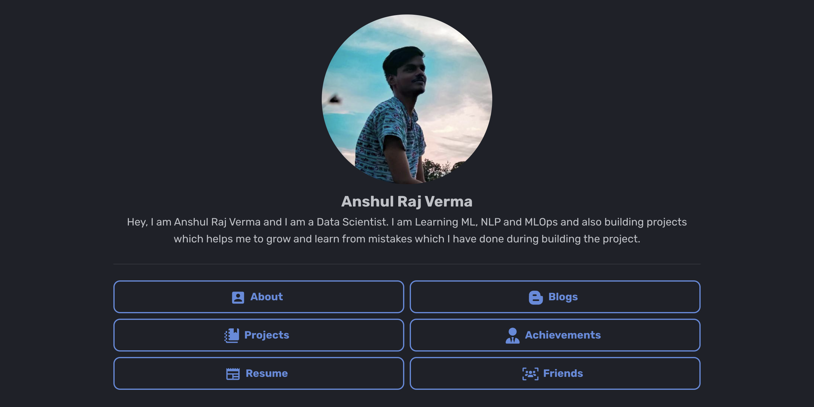

# Personal Website

<p align="center">
    
</p>

<p align="center">
    <a href="https://squidfunk.github.io/mkdocs-material/"></a>
    <a href="https://arv-anshul.github.io"></a>
    <a href="https://github.com/arv-anshul/arv-anshul.github.io/actions"></a>
</p>

## Website's Features

- **Portfolio**: Showcase of my skills, achievements, and projects to provide an overview of my professional journey.
- **Project Index**: A comprehensive index highlighting the details of various projects I've undertaken, including descriptions, technologies used, and outcomes.
- **Projects Details**: In-depth information and specifications about each project, offering a closer look into the methodologies, challenges, and solutions implemented during the development process.
- **Blogs**: A collection of insightful and informative blogs covering a range of topics, sharing knowledge and experiences with the audience.

## Setup Locally

1. Clone this repository with `git`:

    ```bash
    git clone https://github.com/arv-anshul/arv-anshul.github.io
    ```

2. Create a virtual environemt in the cloned directory, then install requirements from `requirements.txt` file using `pip` command:

   ```bash
   pip install -r requirements.txt
   ```

3. Now, you can easily serve the `docs/` folder as a website using `mkdocs` commands:

    ```bash
    mkdocs serve
    ```

4. Optional, if you want to render all the `.md` as `.html`, `.css` and `.js` scripts, then run:

    ```bash
    mkdocs build
    ```

## Acknowledgement

1. A very big thanks to [@squidfunk](https://github.com/squidfunk/mkdocs-material) for making `mkdocs` this easy to use and maintain.
2. A pulgin `mkdocs-markdownextradata-plugin` which help to render the `.md` with `jinja` template. Thanks to [@rosscdh](https://github.com/rosscdh/mkdocs-markdownextradata-plugin/) to create this pulgin.
3. (maybe) My first interaction with `mkdocs` happend while learning [FastAPI](https://fastapi.tiangolo.com/) from its amazing documentation.
4. Finally [@me](https://github.com/arv-anshul), I have learned this tool in almost one day and **I am writting this line at `02:10 AM` midnight in a very cold night and also listening song "Maine Poochha Chand Se"**.
