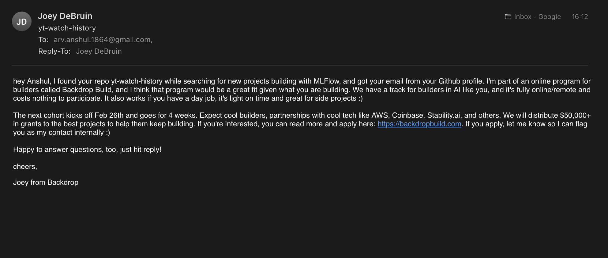

## Week 5 Journal

### Learning

1. **`yt-watch-history`**: After 3 iterations I have understand how to deal with ML models.
2. **`yt-watch-history`**: New PR for `channel_reco` in `frontend`. This PR just take subscription data and shows the
   recommendation of selected channel.

### Thoughts

1. **PROJECT IDEA**: I am thinking about to create a Python Package from which you can scrape website using `cURL`.
2. In `yt-watch-history`, I don't want to give so much time on `frontend` instead more focus on `backend`.

> **CRITICISM**: If you don't focus on `frontend` then it is bad to present and maintain. That's why you should also
> take care of `frontend` part.

## Week 6 Journal

### Learning

1. [**`campusx`**](https://github.com/arv-anshul/campusx): I have built new project where you can get all the notes and
   links provided in the description of sessions of DSMP course.
   - I have created this in **almost 3 days**.
   - Done many things like **follow conventional commits**, written tests and more.
     [See here](https://github.com/arv-anshul/campusx#%EF%B8%8F-project-workflows)
2. I have released `v0.1.0` of `campusx` but I use 🤖 ChatGPT to generate release note (using all commits) and I don't
   think that it is good release note like I see for other projects.
3. 🤓 I want to learn how to write and manage **Release Notes** and **CHANGELOG**.

### Thoughts

1. **Conventional Commits**: For a long time I have been thinking about to follow a convention for **GIT commits** but
   where-ever I check I don't understand then I came across
   [`vivaxy.vscode-conventional-commits`](https://marketplace.visualstudio.com/items?itemName=vivaxy.vscode-conventional-commits)
   a VSCode extension and now I know how to write better commits. 😉
2. **Mkdocs**: `mkdocs-material` is a very powerful tool to create static web pages using **markdowns**.
3. 🎉 The Open Source Contributions of Indians ft. @ApnaCollege.
4. I am thinking about to switch to `pixi` or `rye` because I also want to manage my projects like never before; like
   professional 🤯.

## Week 7 Journal

### Learning

1. [**`rye`**][rye]: My new way to manage projects like pro. I have used it and this is very convenient to use and
   manage.
2. [**`rye`**][rye]: I have raised issue [**#639**][rye/issues/639] while configuring the [`campusx`][campusx] project.
   _For more info see issue itself._
3. [**`astral-sh/uv`**][astral-sh/uv]: Another blazing fast tool for python devs to manage their packages (_written in
   🦀 Rust_).
   - 🤯 This is actually powerful (I have seen it 👀). It is almost **8x** faster than `pip` when I build my
     [`yt-watch-history`][yt-watch-history] project using `docker-compose` it takes 🐢 **~200 seconds** with `pip` but
     now it takes 🐇 **~25 seconds**.
4. [**`starship`**][starship]: Another blazing fast tool for terminal prompts (_written in 🦀 Rust_).
   - 🎉 Yay, I have learned and configured my terminal prompt using `starship`.
5. [**Social Cards**][dsmp-resource]: I have added social card preview on the website. Here, I have hard coded the
   `<meta>` tags (which is not recommended). You can use
   [`social`](https://squidfunk.github.io/mkdocs-material/plugins/social/) builtin plugin of `mkdocs-material`.

### Thoughts

1. **Praise by Nitish Sir** for [`campusx`][campusx] project. See my
   [LinkedIn Post](https://www.linkedin.com/posts/arv-anshul_yesterday-nitish-singh-sir-recommend-activity-7162317549496381440-JskB?utm_source=share&utm_medium=member_desktop)
   on this.
2. [**`yt-watch-history`**][yt-watch-history]: I have been configuring this project with `rye` and there are many
   challenges I have faced while doing this like:
   1. This is a virtual project and there are some limitations comes with **virtual** packages check the issue
      [**#639**][rye/issues/639].
   2. This project contains two separate repos `backend` and `frontend` which make this a monorepo and for now `rye`
      does not well support a monorepo because I have to create one workspace level environment for both repos (and I
      don't kinda like this).

## Week 8 Journal

### Learning

1. [**`Starship`**][starship]: Now I have learned `starship` in a way that I can customize my prompt easily however I
   want to be. I written [a blog](https://arv-anshul.github.io/blog/2024/02/21/starship-prompt/) a on it to. You can
   check my [`starship.toml`](https://github.com/arv-anshul/dotfiles/blob/main/.config/starship.toml) on Github.
2. [**`notebooks/spotify-analysis`**][notebooks/spotify-analysis]: I have started a new project which analyses User's
   Spotify's Streaming History data and give insights from them.
   - I have done some analysis on `StreamingHistory` and `Playlist` dataset and gain some interesting insights from it.

### Thoughts

1. [**backdropbuild.com**](https://backdropbuild.com): I have received a mail from
   [@JoeyDeBruin](mailto:joey@backdroplabs.co) to participate in their program _(which is a kind of Hack-a-thon)_ and
   mentioned my project [**`yt-watch-history`**][yt-watch-history] because he thinks that the project good fit their
   program _(and I am doing this project to learn MLOps concepts like Docker, MLFlow)_.

> [!NOTE]
>
> Hey Joey, Thanks to appreciate my project `yt-watch-history` and also for considering me to participate in your
> program.
>
> Honestly, I am just learning "MLOps" concepts while building this project and for now, I am not sure that I am a good
> fit for your program. And by keeping this in mind I am not able to join but I am sure that I'll join it in future for
> sure.
>
> Thanks Joey   Anshul Raj Verma

## Week 9 Journal

### Learning

1. **😞 Not Much!**
2. But I have watched some sessions of the **DSMP 2.0**.

### Thoughts

1. **Before Wedding**: I am going to wedding for approx. 3-4 days.
2. **After Wedding**: I have absent for **11 days** from **25 Feb — 6 Mar**.

## Week 10 Journal

### Learning

1. [**`rye`**][rye] transferred to [`astral-sh`](https://astral.sh/) Github Organization.
2. **`ruff`** released it `v0.3.0` with new formatting rules `2024-02`.
   [Read the Blog](https://astral.sh/blog/ruff-v0.3.0)
3. I have simplified the complex url of blogs [in my website][arv-anshul.github.io].

### Thoughts

1. I have to bring my laptop to where I go I go because without it I lose many things and make it hard to catch up.

[arv-anshul.github.io]: https://arv-anshul.github.io
[astral-sh/uv]: https://github.com/astral-sh/uv
[campusx]: https://github.com/arv-anshul/campusx
[dsmp-resource]: https://arv-anshul.github.io/campusx/dsmp2
[notebooks/spotify-analysis]: https://github.com/arv-anshul/notebooks/tree/main/spotify-analysis
[rye]: https://rye-up.com
[rye/issues/639]: https://github.com/mitsuhiko/rye/issues/639
[starship]: https://starship.rs
[yt-watch-history]: https://github.com/arv-anshul/yt-watch-history
