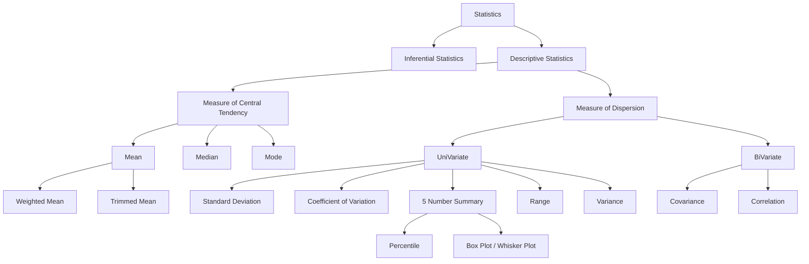

# :octicons-graph-16:{ title="2024-04-12" } Basics of Statistics for ML

<!-- more -->

## Statistics

  - :simple-youtube:{ .lg .middle .youtube } [**Descriptive Statistics Part 1**](https://youtu.be/Uv3Blie7F3g)
  - :simple-youtube:{ .lg .middle .youtube } [**Descriptive Statistics Part 2**](https://youtu.be/1ndVC500-EU)
  - :simple-googledocs:{ .lg .middle .googledocs } [**CampusX Notes - 1**](https://drive.google.com/file/d/1da0Wj1KyUxLtGVnFcPTpgWvKQsWjZly-/view)
  - :simple-googledocs:{ .lg .middle .googledocs } [**CampusX Notes - 2**](https://drive.google.com/file/d/1edN9LSbMP3lPh4YMem4n9K0Y6lSeFaP1/view)
  - :material-file-document:{ .lg .middle .light } [**My Previous Notes**](https://github.com/arv-anshul/campusx-learning/blob/main/Descriptive%20Statistics/README.md)

### Population

Population represents the whole/entire group of individual or object that we are interested in studying.

### Sample

Sample is a subset of Population. It is smaller group of individual or object that we select from the population to study. Samples are used to estimate characteristics of the population.

!!! tip "Things to care while selecting Sample from a Population"

    - Sample Size
    - Random Data
    - Representative

!!! example "Example: Population and Sample Data"

    1. All Python Programmer on the earth VS Python Programmer in India
    2. All cricket fans VS Fans who were present in the stadium
    3. All students VS Who visit college for lectures

## Descriptive Statistics

Helps you to learn underlying information of the data. Generally, data is a Sample of the Population.

The goal of statistical inference is to use the information obtained from the sample to make inferences about the population parameters.

### Measure of Central Tendency

A measure of central tendency is a statistical measure that represents a typical or central value for a dataset. It provides a summary of the data by identifying a single value that is most representative of the dataset as a whole.

You can use methods like Mean, Median, Mode for this.

: **Mean**: The mean is the sum of all values in the dataset divided by the number of values.

    **Median**: The median is the middle value in the dataset when the data is arranged in order.

    **Mode**: The mode is the value that appears most frequently in the dataset.

## Measure of Dispersion

A measure of dispersion is a statistical measure that ^^describes the spread or variability of a dataset^^. It provides ^^information about how the data is distributed around the central tendency^^ (mean, median or mode) of the dataset.

### Variance

The variance is the average of the squared differences between each data point and the mean. It measures the average distance of each data point from the mean and is useful in comparing the dispersion of datasets with different means.

<figure markdown>

|                       Sample Variance                        |                  Population Variance                   |
| :----------------------------------------------------------: | :----------------------------------------------------: |
| `#!math \sigma^2 = \frac{\sum\_{i=1}^{n} (x_i - \bar{x})^2}{n-1}` | `#!math \sigma^2 = \frac{\sum\_{i=1}^{N} (x_i - \mu)^2}{N}` |

</figure>

!!! question "Why `n-1` in Sample Variance?"

    By dividing by `#!math (n−1)`, we make the sample variance an unbiased estimator of the population variance. This correction is particularly important when dealing with small sample sizes, as it helps to reduce bias in the estimation of the population variance.

### Standard Deviation

The standard deviation is the square root of the variance. It is a widely used measure of dispersion that is useful in describing the shape of a distribution like Normal Distribution.

<figure markdown>

|                  Sample Standard Deviation                  |               Population Standard Deviation                |
| :---------------------------------------------------------: | :--------------------------------------------------------: |
| `#!math s = \sqrt{\frac{\sum_{i=1}^{n} (x_i - \bar{x})^2}{n-1}}` | `#!math \sigma = \sqrt{\frac{\sum_{i=1}^{N} (x_i - \mu)^2}{N}}` |

</figure>

### Coefficient of Variation (CV)

CV is the ratio of the standard deviation to the mean expressed as a percentage. It is used to compare the variability of datasets with mean. CV is a statistical measure that expresses the amount of variability in a dataset relative to the mean.

### `#!math \frac{\sigma}{\mu} \cdot 100 = \text{CV}\%`

#### Why Coefficient of Variation exits?

This method is used to compare the variance of two different feature like Salary of Employees and Experience of Employees. But using CV you can compare the variability of those two feature.

**Steps**

1. Calculate Mean and Standard Deviation of both feature.
2. Calculate CV of each feature using above formula.
3. Now, you can compare both feature's CV to know which is feature has more
    variability.

> :raising_hand: **Note**: This statistical method is not widely used.

## Inferential Statistics

Using Inferential Statistics we make conclusions and predictions about a population based on a sample.

It involves the use of probability theory to estimate the likelihood of certain events occurring, hypothesis testing to determine if a certain claim about a population is supported by the data, and regression analysis to examine the relationships between variables.

### Covariance

Covariance is a statistical measure that describes the degree to which two variables are linearly related. It measures how much two variables change together, such that when one variable increases, does the other variable also increase, or does it decrease?

### `#!math \text{Cov}(x, y) = \frac{\sum_{i = 0}^{n}{(x_i - \bar{x}) (y_i - \bar{y})}}{n - 1}`

#### Interpretation

If the covariance between two variables is positive, it means that the variables tend to move together in the same direction. If the covariance is negative, it means that the variables tend to move in opposite directions. A covariance of zero indicates that the variables are not linearly related.

#### Disadvantage

One limitation of covariance is that it does not tell us about the strength of the relationship between two variables, since the magnitude of covariance is affected by the scale of the variables.

#### Variance V/S CoVariance

- Covariance is a measure of how much two variables change together, while variance is a measure of how much a single variable changes from its mean.
- The variance of a variable is the average of the squared differences from the mean, while the covariance between two variables is the average product of their deviations from their respective means.

{ .base-border-radius style="filter: invert(100%);" }

### Corelation

Correlation refers to a statistical relationship between two or more variables. Specifically, it measures the degree to which two variables are related and how they tend to change together.

### `#!math \text{Correlation} = \frac{\text{Cov}(x, y)}{\sigma x * \sigma y}`

#### Interpretation

Correlation is often measured using a statistical tool called the correlation coefficient, which ranges from -1 to 1, A correlation coefficient of -1 indicates a perfect negative correlation, a correlation coefficient of 0 indicates no correlation, and a correlation coefficient of 1 indicates a perfect positive correlation.

#### Correlation and Causation

The phrase ^^"correlation does not imply causation"^^[^1] means that just because two variables are associated with each other, it does not necessarily mean that one causes the other.

In other words, a correlation between two variables does not necessarily imply that one variable is the reason for the other variable's behavior.

[^1]: **"correlation does not imply causation"**: Agar koi ghatna correlated hai toh iska matlab yeh nhi ki pehle ghatna ki hone ki wajah se he dusri ghatna ho rhi hai.

!!! abstract "Example"

    Suppose there is a positive correlation between the number of :firefighter: firefighters present at a fire and the amount of :adhesive_bandage: damage caused by the :fire: fire. One might be tempted to conclude that the presence of :firefighter: firefighters causes more :adhesive_bandage: damage. However, this correlation could be explained by a third variable - the severity of the fire. More severe fires might require more firefighters to be present, and also cause more damage.

    Thus, while correlations can provide valuable insights into how different variables are related, they cannot be used to establish causality. Establishing causality often requires additional evidence such as experiments, randomized controlled trials, or well-designed observational studies.
