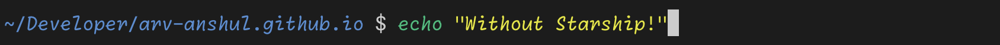

---
date:
  created: 2024-02-21
  updated: 2024-03-19
authors:
  - arv-anshul
description: |
  The minimal, blazing-fast, and infinitely customizable prompt for any shell!
categories:
  - others
slug: starship-prompt
title: Starship Prompt
icon: simple/starship
---

# :simple-starship:{ .middle title="2024-02-21" } Starship Prompt

<figure markdown>




<figcaption>
I have introduced to Starship Prompt a week ago and it makes my shell prompt amazing.
</figcaption>
</figure>

<!-- more -->

!!! tip "Prerequisites"

    - Install Starship Prompt from [official documentation](https://starship.rs/guide/#step-1-install-starship).
    - Setup your shell (`bash`, `zsh` or `fish`) to use Starship from [official documentation](https://starship.rs/guide/#step-2-set-up-your-shell-to-use-starship)

!!! note

    - I am using **MacOS**. So, for other OS the paths may differ.
    - I have used [**Nerd Fonts**](https://nerdfonts.com) thats why there are some `symbol` which  may not appear as they are.
    - I have defined some conventions to define my `starship.toml` file. If you want to know them read the sections where I describe my conventions.

## :wrench: Customization

You can customize your prompt for each programming languages you uses like :simple-python: Python, :simple-javascript: JavaScript, :simple-rust: Rust and more. See [official documentation](https://starship.rs/config/) to know more.

### **Example:** :simple-python: Python

```toml
[python]
symbol = "" # (1)!
style = "arv_python"
format = "[](fg:$style)[$symbol( $version)[( \\($virtualenv\\))](bold bg:$style)](bg:$style)[](fg:$style)"
```

1. :simple-python:

### **Example:** :simple-docker: Docker

```toml
[docker_context]
symbol = "" # (1)!
style = "arv_docker"
format = "[](fg:$style)[$symbol ($context)](bg:$style)[](fg:$style)"
```

1. :simple-docker:

??? example "Conventions"

    1. **Enclosed Modules**: Each modules enclose with circular end.

## :art: Color Palette

Did you see `style = "arv_python"` and `style = "arv_docker"` in above examples.
Those are my custom defined **palette** as `"arv-anshul"`.

```toml
palette = "arv-anshul"

[palettes.arv-anshul]
arv_dir = "203"
arv_docker = "026"
arv_git = "063"
arv_python = "028"
arv_custom = "236"
```

??? warning "Print ANSI Colormap"

    ```bash
    # Use this function to print ANSI colormap
    function colormap() {
        range_start=${1:-1}
        range_end=${2:-255}

        for i in $(seq $range_start $range_end); do
            echo -en "\e[48;5;${i}m  ${(l:3::0:)i}  \e[0m "
            [[ $((i % 10)) -eq 0 ]] && echo
        done
        return 0
    }
    ```

If you doc't want to use ANSI color format then you also use `starship`'s pre-defined colors: `black`, `red`, `green`, `blue`, `yellow`, `purple`, `cyan`, `white`. You can optionally prefix these with `bright-` to get the bright version (e.g. `bright-white`). [See in documentation](https://starship.rs/advanced-config/#style-strings)

```toml
palette = "arv-anshul-color"

[palettes.arv-anshul-color]
arv_dir = "bright-red"
arv_docker = "bright-blue"
arv_git = "blue"
arv_python = "green"
arv_custom = "black"
```

??? example "Conventions"

    1. **Palette Preffix**: Palette's `keys` must have a preffix (in my case it is `#!py "arv_"`).
    2. **ANSI Codes**: I have defined colors in **ANSI Codes**. See this [Gist](https://gist.github.com/fnky/458719343aabd01cfb17a3a4f7296797 "Github Gist") to know more about ANSI Codes.
    3. **Own Color Palette**: I have defined programming language-wise _(or module-wise)_{ title="In Starship Language" } colors which makes easy to change/manipulate the color of any language.

> You can also create your own custom color palette in `~/.config/starship.toml`{ title="In MacOS" }.

## :people_hugging: Extra customization with custom modules

```toml
[custom.github]
detect_folders = [".github"]
format = "[$symbol]($style)"
style = "bg:arv_custom"
symbol = " " # (1)!

[custom.mkdocs]
detect_files = ["mkdocs.yaml", "mkdocs.yml"]
detect_folders = ["docs"]
format = "[$symbol]($style)"
style = "bg:arv_custom"
symbol = "󱔗 " # (2)!

[custom.vscode]
detect_folders = [".vscode"]
format = "[$symbol]($style)"
style = "bg:arv_custom"
symbol = "󰨞 " # (3)!
```

1. :simple-github:
2. :material-file-document-multiple:
3. :material-microsoft-visual-studio-code:

??? example "Conventions"

    I have used `custom` modules to just show some desirable icons in the prompt but you can do a lot of thing using `custom` modules _(the possibilities are endless)_.

    1. **Show Custom Icons**: I used `custom` modules to show icons by detecting files and folders. For example, prompt will show :simple-github: icons when `.github` folder is present in the current directory.

> Refer to [official documentation](https://starship.rs/config/#custom-commands) to know more about custom modules.

!!! tip

    > From official documentation

    [Issue #1252](https://github.com/starship/starship/discussions/1252) contains examples of `custom` modules. You can go there for inspiration and if you have an interesting example not covered there, feel free to share it there!

---

<figure markdown>

{ .heart }

<figcaption>If you want to make prompt to look like mine! Click below</figcaption>
</figure>

<p align="center" markdown>
[:simple-starship:{ .lg .middle .bounce }&nbsp; starship.toml](https://github.com/arv-anshul/dotfiles/blob/main/.config/starship.toml){ .md-button }
</p>
