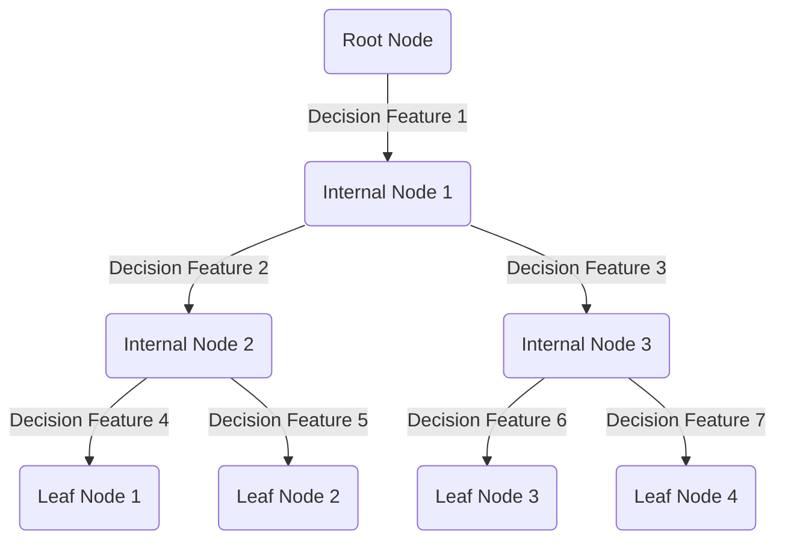

---
date:
  created: 2024-01-29
  updated: 2024-01-29
authors:
  - arv-anshul
  - chatgpt
description: |
  An overview of Decision Tree algorithm in Machine Learning.
categories:
  - ml
slug: overview-decision-tree
title: "Overview: Decision Tree"
---

# :material-graph-outline:{ title="2024-01-29" } Overview: Decision Tree

Decision tree is a very crucial algorithm in ML world because using this algorithm there are many important and some of the best algo of ML is made upon like RandomForest and Xgboost.

That's why we going to take a overview of Decision Tree in this blog.

## Anatomy of Decision Trees

A decision tree is a popular machine learning algorithm used for both classification and regression tasks. It is a tree-like model composed of nodes, where each internal node represents a decision based on a feature, each branch represents the outcome of that decision, and each leaf node represents the final prediction.

- **Root Node**: The topmost node that makes the initial decision.
- **Internal Nodes**: Decision nodes that split the data based on a particular feature.
- **Branches**: Outcomes of decisions, leading to the next set of nodes.
- **Leaf Nodes**: Terminal nodes providing the final predictions.

## Loss Functions

Decision trees use various loss functions depending on the task:

- **Classification**: Commonly use metrics like Gini impurity or cross-entropy.
- **Regression**: Typically use mean squared error.

## Gini Impurity in Decision Trees

### How Gini Impurity Works?

Gini impurity is a measure of how often a randomly chosen element from the set would be incorrectly labeled. For a binary classification problem, the Gini impurity (Gini index) for a node is calculated as follows:

$$ \text{Gini(D)} = 1 - \sum_{i=1}^{c} (p_i)^2 $$

Where:

- $(D)$ is the dataset at the node.
- $(c)$ is the number of classes.
- $(p_i)$ is the probability of choosing a data point of class $i$.

### Example

Consider a node with 30 samples, distributed among two classes (A and B) as follows:

- Class A: 15 samples
- Class B: 15 samples

$$ \text{Gini(D)} = 1 - \left(\left(\frac{15}{30}\right)^2 + \left(\frac{15}{30}\right)^2\right) $$

$$ \text{Gini(D)} = 1 - \left(\frac{1}{4} + \frac{1}{4}\right) $$

$$ \text{Gini(D)} = 1 - \frac{1}{2} = \frac{1}{2} $$

The goal during the tree-building process is to minimize the Gini impurity at each node.

??? tip "Watch StatQuest video on Decision Tree :material-graph:"

    <iframe width="700" height="400" src="https://www.youtube-nocookie.com/embed/_L39rN6gz7Y?si=Ua08hw0Wp1vtTtdE&amp;start=18" title="StatQuest - Decision Tree" frameborder="0" allow="accelerometer; autoplay; clipboard-write; encrypted-media; gyroscope; picture-in-picture; web-share" allowfullscreen></iframe>

??? tip "Gini Impurity Clearly Explained :material-family-tree:"

    <iframe width="700" height="400" src="https://www.youtube-nocookie.com/embed/u4IxOk2ijSs?si=WwzITA_q9of6sJL8&amp;start=18" title="Gini Impurity - Serrano.Academy" frameborder="0" allow="accelerometer; autoplay; clipboard-write; encrypted-media; gyroscope; picture-in-picture; web-share" allowfullscreen></iframe>

## Advantages and Disadvantages

  - **Interpretability**{ .success }

    ---

    Decision trees provide a transparent and intuitive representation of decision-making. This makes them valuable for communication with non-technical stakeholders. A data scientist can easily explain the logic behind predictions, fostering trust in the model.

  - **No Feature Scaling Required**{ .success }

    ---

    Decision trees are not affected by the scale of features. This means that data scientists don't have to spend time and effort on feature scaling, making the preprocessing phase simpler and more straightforward.

  - **Handle Mixed Data Types**{ .success }

    ---

    Decision trees can handle both numerical and categorical data without the need for one-hot encoding. This is advantageous when dealing with datasets that contain a mix of data types.

  - **Require Less Data Preprocessing**{ .success }

    ---

    Decision trees are less sensitive to outliers and missing values compared to some other algorithms. This can save time during the data cleaning and preprocessing stages.

  - **Feature Importance**{ .success }

    ---

    Decision trees provide a natural way to assess the importance of different features in the prediction. Data scientists can easily identify which features contribute more significantly to the model's decision-making process.

  - **Overfitting**{ .danger }

    ---

    Decision trees are prone to overfitting, especially when the tree is deep and captures noise in the training data. Data scientists need to carefully tune hyperparameters, such as the tree depth, to prevent overfitting and ensure better generalization to new data.

  - **Instability**{ .danger }

    ---

    Small variations in the training data can lead to different tree structures. This instability can make decision trees sensitive to the specific training dataset, requiring caution when deploying the model in different environments.

  - **Not Suitable for Complex Relationships**{ .danger }

    ---

    Decision trees may not capture complex relationships in the data as effectively as more advanced algorithms.

  - **Biased Toward Dominant Classes**{ .danger }

    ---

    In classification problems with imbalanced classes, decision trees can be biased toward the dominant class. This can impact the model's performance, especially when accurate predictions for minority classes are crucial.

  - **Not Well-Suited for Regression**{ .danger }

    ---

    While decision trees are excellent for classification tasks, they may not perform as well for regression tasks on continuous data. Other algorithms like linear regression or support vector machines might be more appropriate in such cases.

## Conclusion

In conclusion, decision trees are powerful tools with a clear structure and interpretability. Understanding their components, loss functions, and characteristics will help you effectively apply and interpret this versatile algorithm.
