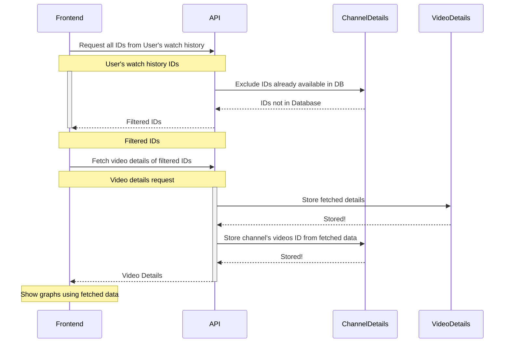

# :simple-mermaid: Architecture for Version 2

## Application Interaction

- Architecture of `backend`, `ml` and `frontend`.
- How do `backend`, `ml` and `frontend` interacts?


??? tip "Code for Diagram"

    ```
    styleMode plain

    Container 1 [icon: docker, color: blue] {
    ML Models [icon: machine-learning] {
        Conetnt Type Predictor [icon: machine-learning]
        Channel Recommender System [icon: machine-learning]
    }
    ML Models API [icon: fastapi, color: green]
    }

    YouTube Data v3 API [icon: youtube, color: red]
    Container 2 [icon: docker, color: blue] {
    MongoDB [icon: mongodb, color: green] {
        Video Details [icon: database]
        Channel Details [icon: database]
    }
    Backend API [icon: fastapi, color: green]
    }

    Container 3 [icon: docker, color: blue] {
    Frontend [icon: streamlit, color: red]
    }

    User [icon: user]

    User > Container 3
    Container 3 > Backend API, ML Models API
    Backend API > MongoDB
    Backend API > YouTube Data v3 API
    ML Models API > ML Models
    ```

## Frontend and Backend API Interaction

- What happens when user upload their `watch-history.json` data to see analysis?
- More and better data retrival for analysis.
- Use of **YouTube Data v3 API** to fetch more details of watched videos.



??? tip "Code for diagram"

    ```
    styleMode plain

    Frontend [icon: streamlit, color: red]
    API [icon: fastapi, color: green]
    ChannelDetails [icon: mongodb, color: purple, label: Channel Videos ID DB]
    VideoDeatils [icon: mongodb, color: orange, label: Video Details DB]
    Frontend > API: All IDs from User's watch history

    activate Frontend
    API > ChannelDetails: Exclude IDs already available in DB
    ChannelDetails > API: IDs not in Database
    API > Frontend: Filtered IDs
    deactivate Frontend

    Frontend > API: Fetch video details of filtered IDs

    activate API
    API > VideoDeatils: Store fetched details
    VideoDeatils > API : Stored!
    API > ChannelDetails: Store channel's videos ID from fetched data
    ChannelDetails > API : Stored!
    API > Frontend: Video Details
    deactivate API
    ```

## ML Model Working

- How does ML Model inference through API?
- ~~How to train ML Model on my custom data?~~


??? tip "Code for diagram"

    ```
    direction right
    styleMode plain

    user [icon: user, shape: diamond, label: User]
    inputData [icon: data, shape: cylinder, label: Input Data]
    model [icon: machine-learning, shape: document, label: ML Model]
    mlApi [icon: fastapi, label: ML API]
    modelOnWeb [icon: globe, shape: oval, label: Model On Web]
    prediction [icon: graph, label: Model Prediction]

    user > inputData
    inputData > mlApi
    mlApi > model: Exists
    mlApi > modelOnWeb: Not Exists
    modelOnWeb > model: Download and Store
    model > prediction
    prediction > user
    ```

## User Data Flow

- Data manipulation after user uploads their data on application.
- Use of **YouTube Data v3 API** to fetch more details about watched videos.
- Leveraging the power of Python libraries like [Polars] for data manipulation. _We can use [Pandas] also._{ .secondary }

    [Polars]: https://pola.rs
    [Pandas]: https://github.com/pandas-dev/pandas


??? tip "Code for diagram"

    ```
    styleMode plain

    watchHistory [icon: user, color: blue] {
        title_ string
        titleUrl string
        time datetime
        subtitle dict
    }

    preprocessedWatchHistory [icon: pandas, color: blue] {
        videoId string
        title_ string
        channelId string
        channelTitle string
    }

    watchHistory.title_ - preprocessedWatchHistory.title_
    watchHistory.titleUrl - preprocessedWatchHistory.videoId
    watchHistory.subtitle - preprocessedWatchHistory.channelTitle
    watchHistory.subtitle - preprocessedWatchHistory.channelId

    videoDetails [icon: youtube, color: red] {
        id string
        title_ string
        channelId string
        description string
        tags list[string]
        publishedAt datetime
    }

    mergedData [icon: table, color: yellow] {
        videoId string
        title_ string
        channelId string
        channelTitle string
        description string
        tags string
        publishedAt datetime
    }

    preprocessedWatchHistory.videoId - mergedData.videoId
    preprocessedWatchHistory.title_ - mergedData.title_
    preprocessedWatchHistory.channelId - mergedData.channelId
    preprocessedWatchHistory.channelTitle - mergedData.channelTitle
    videoDetails.tags - mergedData.tags
    videoDetails.description - mergedData.description
    videoDetails.publishedAt - mergedData.publishedAt
    ```

??? example "Diagram with mermaid"

    ```mermaid
    erDiagram
        WATCH_HISTORY {
            title_ string
            titleUrl string
            time datetime
            subtitle dict
        }

        PREPROCESSED_WATCH_HISTORY {
            videoId string
            title_ string
            channelId string
            channelTitle string
        }

        VIDEO_DETAILS {
            id string
            title_ string
            channelId string
            description string
            tags list
            publishedAt datetime
        }

        MERGED_DATA {
            videoId string
            title_ string
            channelId string
            channelTitle string
            description string
            tags string
            publishedAt datetime
        }

        WATCH_HISTORY ||--|| PREPROCESSED_WATCH_HISTORY: title_
        WATCH_HISTORY ||--|| PREPROCESSED_WATCH_HISTORY: titleUrl
        WATCH_HISTORY ||--|| PREPROCESSED_WATCH_HISTORY: subtitle
        WATCH_HISTORY ||--|| PREPROCESSED_WATCH_HISTORY: subtitle

        PREPROCESSED_WATCH_HISTORY ||--|| MERGED_DATA: videoId
        PREPROCESSED_WATCH_HISTORY ||--|| MERGED_DATA: title_
        PREPROCESSED_WATCH_HISTORY ||--|| MERGED_DATA: channelId
        PREPROCESSED_WATCH_HISTORY ||--|| MERGED_DATA: channelTitle

        VIDEO_DETAILS ||--|| MERGED_DATA: tags
        VIDEO_DETAILS ||--|| MERGED_DATA: description
        VIDEO_DETAILS ||--|| MERGED_DATA: publishedAt
    ```
