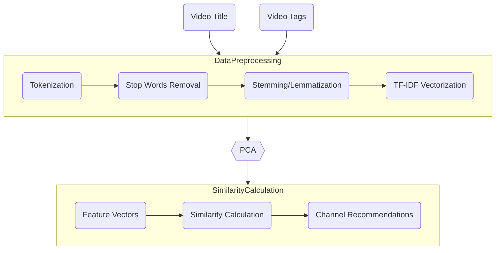

# Channel Recommender System V2

The system starts with preprocessing the video titles and tags by tokenizing, removing stop words, and stemming/lemmatizing them. Then, these texts are vectorized using TF-IDF to convert them into numerical form. The feature vectors are used to calculate similarities between channels using cosine similarity. The channels are ranked based on these similarity scores, and the top-N channels are recommended to the user.

{==

This approach leverages the content-based filtering technique to find and recommend channels that have similar video titles and tags to those the user has already watched, ensuring relevant and personalized recommendations.

==}

## Approach Layers

1. **Input Layer:** Accepts video titles and tags.
2. **Text Processing Layer:** Applies tokenization, stop words removal, and stemming/lemmatization.
3. **Vectorization Layer:** Converts processed text to TF-IDF vectors.
4. **Similarity Calculation Layer:** Computes similarities between channels using cosine similarity.
5. **Recommendation Layer:** Ranks channels based on similarity scores and recommends the top-N channels.

## Process Explanation

1. **Data Preprocessing:**
    - **Tokenization:** Split titles and tags into individual words or phrases.
    - **Stop Words Removal:** Remove common words that do not add value to the recommendation (e.g., "the", "and").
    - **Stemming/Lemmatization:** Reduce words to their base form to handle different variations.
    - **Vectorization:** Convert the processed text into numerical vectors using methods like TF-IDF (Term Frequency-Inverse Document Frequency).

2. **Feature Extraction:**
    - **TF-IDF Vectorizer:** Transform the textual data into feature vectors.
    - **Dimensionality Reduction:** Optionally, use techniques like PCA (Principal Component Analysis) to reduce the feature space.

3. **Model Training:**
    - **Content-Based Filtering:** Calculate the similarity between videos using cosine similarity or other distance metrics.
    - **Training Algorithm:** Use algorithms like k-Nearest Neighbors (k-NN) for finding similar channels based on the content similarity of their videos.

4. **Recommendation:**
    - For a given user's watched history, calculate the similarity scores of channels and recommend the top-N channels with the highest scores.
