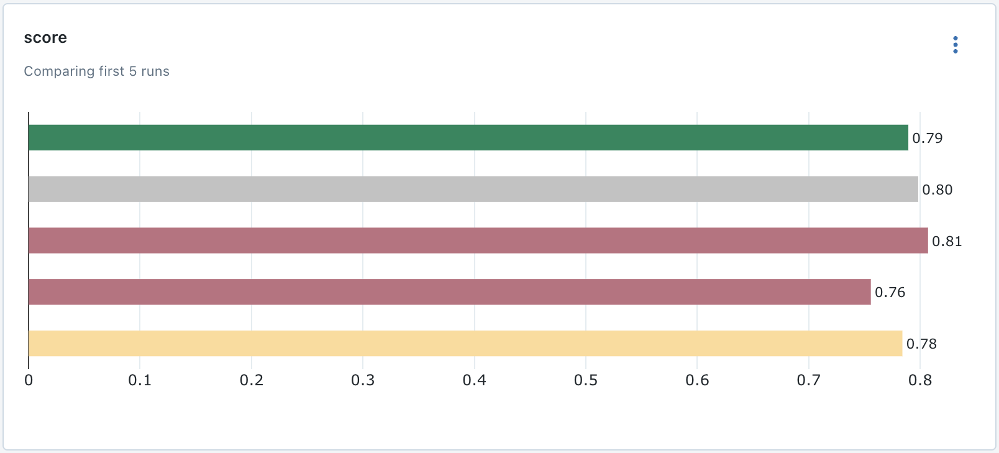

# :simple-scikitlearn:{ title="2024-01-27" } ContentType Prediction

I am building the ContentType Prediction System from scratch, this it is more robust, flexible and scalable.

- I have created custom `sklearn` transformers to transform the datasets. :material-chat-question:{ title="But it is not that good." }
- I also implemented the model monitoring part using abstraction classes. I do monitoring using `mlfow`.
- I also write scripts for the reference about how to monitor, train and predict models, through this I want to give you some idea that how does this pipeline works. :material-emoticon-wink:{ title="These scripts are for reference only." }

## Custom Transformers using `sklearn`

Yesterday, I have learned how to create a custom transformer using `sklearn` API.

I find it very useful and and ver elegant way to create pipelines with it. They are very simple to use and implement when you get it right.

??? info "A high level info about custom transformers."

    - Create a class which inherit two `sklearn` classes from `sklearn.base` module `TransformerMixin` and `BaseEstimator`.
    - Now, you have to define `fit` and `transform` methods in your class.
    - And you are ready to use this custom transformer.

    Remember this is not a fully pleged custom class because there are numerous things you have to keep in mind while making a custom transformer using `sklearn` API.

!!! abstract "References"

    - [:simple-youtube: Professional Preprocessing with Pipelines in Python - NeuralNine](https://youtu.be/h1BnRBzYjYY)
    - [:simple-youtube: Developing a Custom Scikit-learn Transformer and Estimatior - Ploomber](https://youtu.be/6zAPRfhDg7Q)
    - [:material-file-document: Developing custom scikit-learn transformers and estimators](https://ploomber.io/blog/sklearn-custom/)

## Monitoring with `mlflow`

{++**1st Draft**++}

I have think a custom monitoring pipeline where you pass the model and params with the training and testing set. Then it calculate the score and log it with `mlflow`.

<figure markdown>
  
  <figcaption>MLFlow UI showing scores of multiple trained models on bar chart.</figcaption>
</figure>
